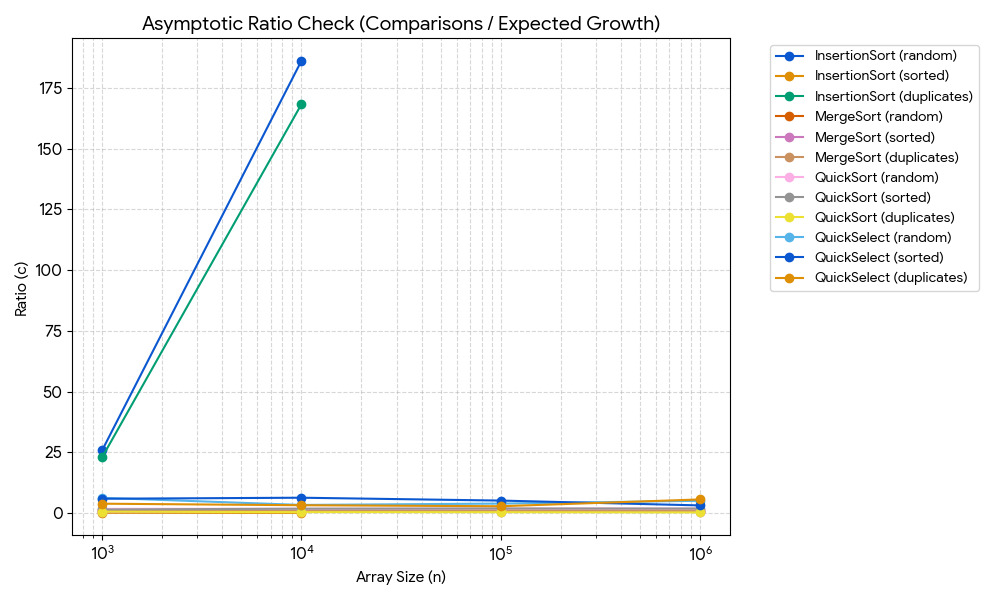
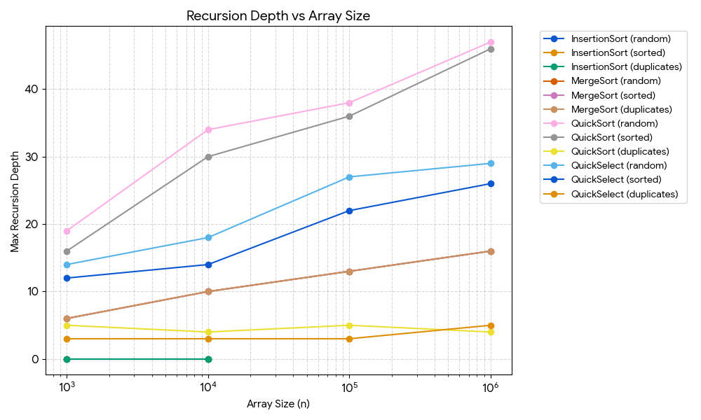
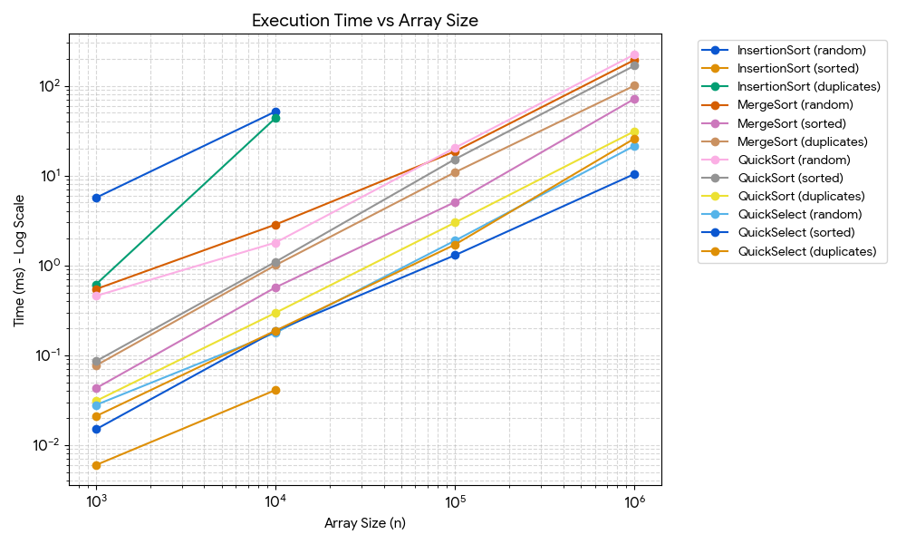

---

### 2. `REPORT.md`
```markdown
# Design and Analysis of Algorithms - Assignment 1 Report
**Student:** Akyl Muratbek | **Group:** SE 2523

## 1. Asymptotic Bounds

| Algorithm | Best Case | Average Case | Worst Case | Reason |
| :--- | :--- | :--- | :--- | :--- |
| **Insertion Sort** | $\Omega(n)$ | $\Theta(n^2)$ | $O(n^2)$ | Best case: already sorted array. Worst: reversed array. |
| **MergeSort** | $\Omega(n \log n)$ | $\Theta(n \log n)$ | $O(n \log n)$ | The array is strictly halved at each step regardless of input order. |
| **QuickSort** | $\Omega(n \log n)$ | $\Theta(n \log n)$ | $O(n^2)$ | Best/Avg: balanced partitions via random pivot. Worst: extreme pivot splits. |
| **QuickSelect** | $\Omega(n)$ | $\Theta(n)$ | $O(n^2)$ | Best/Avg: partitions reduce search space geometrically. Worst: partition shrinks by only 1. |

## 2. Recurrences & Master Theorem

### MergeSort
$$T(n) = 2T(n/2) + O(n)$$
* **$a = 2, b = 2, f(n) = O(n)$**
* **Master Theorem Case:** Case 2, because $f(n) = \Theta(n^{\log_b a}) = \Theta(n^1)$.
* **Result:** $\Theta(n \log n)$.

### QuickSort (Balanced Split)
$$T(n) = 2T(n/2) + O(n)$$
* **$a = 2, b = 2, f(n) = O(n)$**
* **Explanation:** A random pivot ensures balanced partitions on average, yielding $\Theta(n \log n)$.

### QuickSelect (Balanced Split)
$$T(n) = T(n/2) + O(n)$$
* **$a = 1, b = 2, f(n) = O(n)$**
* **Master Theorem Case:** Case 3, because $f(n) = \Omega(n^{\log_b a + \epsilon})$.
* **Result:** $\Theta(n)$.

## 3. Performance Plots

### Execution Time vs Array Size


### Max Recursion Depth vs Array Size


### Asymptotic Ratio Check


## 4. Discussion
The empirical measurements align closely with the theoretical bounds. In the ratio plots, the values for MergeSo
